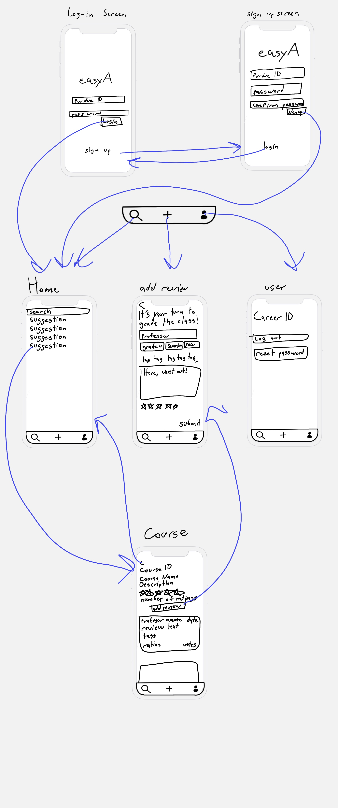
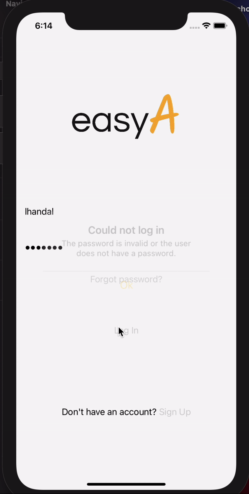

# Product Spec Design: easyA
The easyA app will allow Purdue Students to create and read reviews about their courses. This will allow students to get an impression of what their peers think of a specific course. This will help students choose which classes to take and even have a better idea of their majors in the future. easyA aims to reduce the uncertainty of students trying to choose majors or tracks inside a specific major.

## 1. User Stories (Required and Optional)

**Required Must-have Stories**

- [x] User can sign up
- [x] User can log in
- [x] User can log out
- [x] User can reset their password
- [x] User can search for an specific course and see its reviews
- [x] User can add a review to a course
- [x] User can add a rating to a review
- [x] User can add a comment to a review
- [x] User can add a professor to a review
- [x] User can add a grade to a review
- [x] User can add the semester they took the course to a review
- [x] User can find most Purdue courses
- [x] User can add only one review per course
- [x] User can upvote a review
- [x] User can downvote a review
- [x] All user are Purdue students

**Optional Nice-to-have Stories**

- [ ] User gets auto-complete suggestions when searching for a course
- [ ] User can share a post
- [ ] User can report a post
- [ ] User can share a course
- [ ] User can filter reviews on a course (by professor, tags, etc)
- [ ] User can sort reviews on a course (by date, ratings, upvortes, downboates, etc)
- [ ] User can edit a review
- [ ] User can contact administrators
- [x] User can find all his reviews on his profile
- [x] User gets alerts when an error happens
- [x] App has a dark/light mode
- [x] User can delete their review

## 2. Screen Archetypes

 * Login Screen
  - [ ] User can login
  - [ ] User can reset their password
 * Signup Screen
  - [ ] User can sign up
* Home Screen
 - [ ] User can search for a course
* Course Screen
 - [ ] User can see reviews
 - [ ] User can upvote/downvote reviews
 - [ ] User can add a review to a course
* New Review Screen
 - [ ] User can add a tags to a review
 - [ ] User can add a rating to a review
 - [ ] User can add a comment to a review
 - [ ] User can add a professor to a review
 - [ ] User can add a grade to a review
 - [ ] User can add a tags to a review
[ ] User Screen
 - [ ] User can log out
 - [ ] User can reset their password

## 3. Navigation

**Tab Navigation** (Tab to Screen)

 * Home/Search
 * Add a review
- [ ] User

**Flow Navigation** (Screen to Screen)

 * Login Screen
   => Sign up
   => Home
* Sign up Screen
  => Login
  => Home
* Home
  => Course
* Course
  => Add a review
* Add a review
  => Course

**Wireframes**

## Schema
### Models
#### Review

   | Property      | Type     | Description |
   | ------------- | -------- | ------------|
   | objectId      | String   | unique id for the review |
   | author        | Pointer to User| review author |
   | course       | Pointer to Course| course reviewed |
   | date           | DateTime | date when the review was created |
   | downvotes       | Number   | Number of  downvotes on the post|
   | upnvotes | Number   | Number of  upvotes on the post |
   | tags    | String   | Concadination of tags|
   | text     | String   | the reviews body|
   | professor     | String   | professor who taught the class |
   | grade     | String   | grade achieved by the student |
   | semester     | String   | semester the student took the class |

#### user

  | Property      | Type     | Description |
  | ------------- | -------- | ------------|
  | objectId      | String   | unique id for the review |
  | email          | String   | the students email|
  | upvoted      | array of pointers to reviews   | unique id for the review |
  | downvoted | array of pointers to reviews   | unique id for the review |

#### course

| Property      | Type     | Description |
| ------------- | -------- | ------------|
| objectId      | String     | unique id for the course |
| courseId     | String     | id assigned by Purdue |
| name          | String     | Name of the course  |
| description | String     | Description of the course  |
| rating          | Number | Average rating of the course  |
| rewviews    | array of pointers to reviews  | Average rating of the course  |

### Networking
#### List of network requests by screen
   - Home Feed Screen
      - (Read/GET) Query all courses that that match the user's input
   - Create Review Screen
      - (Create/POST) Create a new post review
   - Profile Screen
      - (Read/GET) Query to log out
      - (Read/GET) Query to reset password
  - Course Screen
     - (Read/GET) Query to get course info
     - (Update/PUT) Toggle upvote
     - (Update/PUT) Toggle downvote
     - (Delete) Delete review

## Video Walkthrough

[https://youtu.be/SlnhrG75RUg](https://youtu.be/SlnhrG75RUg)

## GIF Walkthrough

